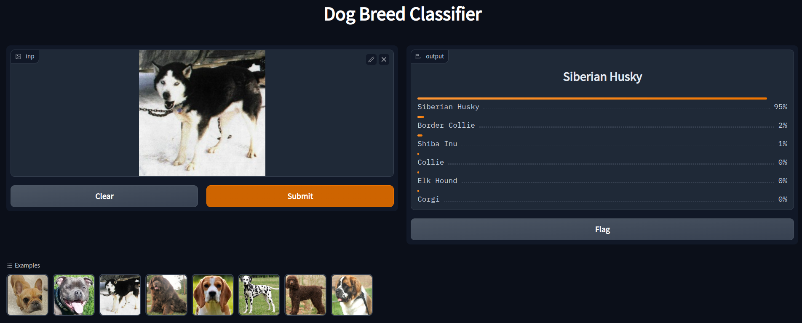
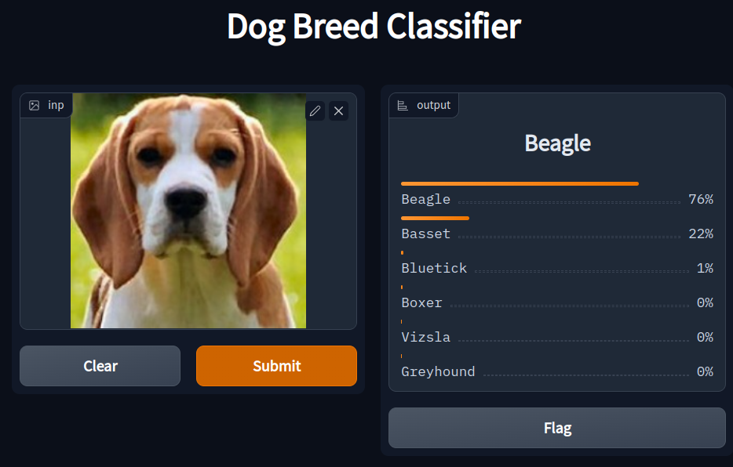
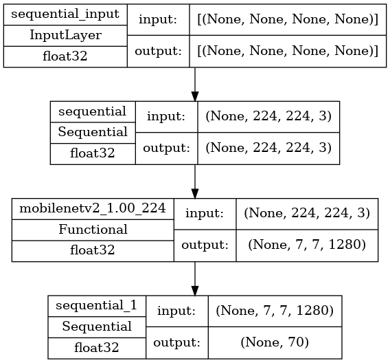

# Dog Breeds AI
🐕 This repository contains the application that allows users to perform a breed classification of a dog image.



# Example


# Configuration
## Dataset
The dataset that has been used is the [Dog Breeds Dataset](https://www.kaggle.com/datasets/gpiosenka/70-dog-breedsimage-data-set). Which contains 70 classes, split into train, validation, and test folders.
If you wish to train the model on your own, you can download the dataset, and specify it's path in the application. Just change the ```DATA_PATH```'s variable value in the Classifier.ipynb file. Example
```
DATA_PATH = "C:/Users/Moez/Desktop/Dog_Breeds"
```

## Installing packages
After doing so, it is recommended to create a new environment, and to run the following command to install the necessary python packages.
```
pip install -r requirements.txt
```

## Usage
To use the web app directly, just run this command in a desired terminal and open the hosted app address in a browser.
```
python app.py
```
# Training
Training took approximately **45 minutes** to complete, with a **batch size of 16**. The model has been trained over **20 epochs**, it has an **accuracy of 93%** on the validation set.

# Convolutional Neural Network
* The deep learning model that has been used, is a pretrained MobileNet model. The pretrained MobileNet model has been chosen for speed and simplicity reasons.
* The final linear layer has been removed, in order to add a classifier model, which contains :
    * A ```GlobalAveragePooling2D``` layer,
    * A Dropout of ```0.2```,
    * A Final Dense layer of size 70 (Number of dog breeds).
* The learning rate is ```0.00001```,
* The optimizer in use is the ```Adam optimizer```.

